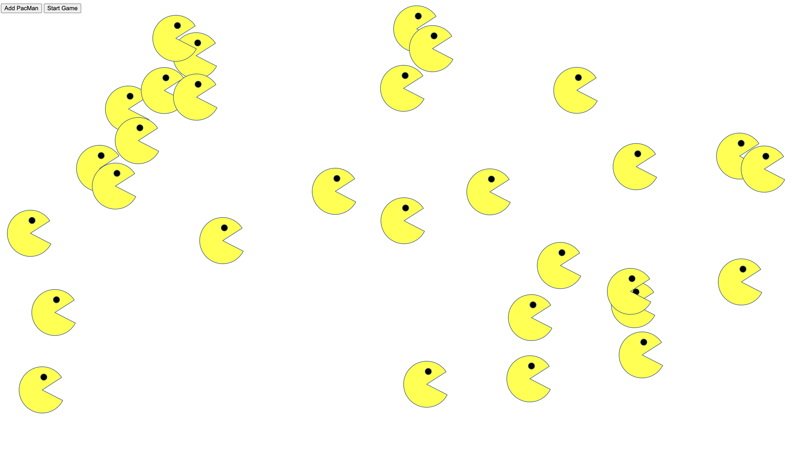

# Pacmen Factory Exercise

PacMan is a popular arcade game. To play, you move PacMan through a maze trying to eat all the white dots while avoiding the colorful ghosts. This exercise has some similiarites to the game but also some differences. Unlike the game, this exercise uses the PacMan image and is able to create a PacMan on demand. When a given PacMan hits the edge of the screen, it changes position to stay within the frame of the web page. A button, "Add PacMan", once clicked, triggers a function that will create a new PacMan; the PacMan will appear at a random positon on the screen. Than a different button, "Start Game", once clicked, triggres a function that will start moving the PacMan or PacMen created at a random velocity on the screen.

## Project Status
Work in progress, always

## License Information
MIT license (see LICENSE.md file for additional details)

## How to Run 
Fork repo and be on your way!

## Roadmap of Future Improvements
No additional improvements or updates to this repo anytime soon

## Maintainers
Justine Kyro (justinejkyro)
